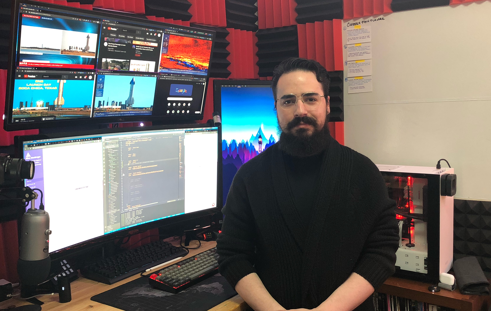

---

I'm a software engineer and entreprenuer based in **Toronto, Canada**. I have 15 years of professional experience building project and innovative solutions both in and outside of the e-commerce space. 

I currently work for a cool canadian company in the HR, Benefits and Payroll space called **[Humi](https://humi.ca)**. Outside of my day job, I build my own **products and services**; currently working on [Siteguardian](https://siteguardian.dev)

## Skills and experience

Over the past **15 years** I have been fortunate enough to experience many different roles at both the invididual contributor level and at the management level up to the executive level, managing departments of **upwards 40 engineers.**

### E-commerce Engineer
I have spent nearly half of my career on the **e-commerce** space touching all areas from consulting and guiding companies on digital transformations, to building custom systems to handle business logic for inventory, order management and payments.

Currently I'm still involved on the space and working on a few **prototypes** to explore the next generation of e-commerce solutions.

### Software Engineering Manager 
A topic close to my hearth is software engineering management, over the past 5 years I have specialized on managing, mentoring and leading highly effective and efficient software engineering teams. 

### Full-Stack Development
As part of the skill required to be an effective e-commerce engineer, having a good understanding and mastery of full-stack web development is required; and I been fortunate to work with a miriad of technologies like **PHP**, **Scala**, **Elixir** and Ruby on the Backend; and **Typescript**, **Angular**, **React**, and **Vue** in the Frontend. 

## Keep in touch

Message me on [Twitter](https://twitter.com/allanmacgregor) or you can email me at `info [at] allanmacgregor.com`

## Other

- Streaming: [Twitch](https://www.twitch.tv/amacgregor) | [Youtube](https://www.youtube.com/channel/UCqcJE6lxT_vzGGSaUCy2efA)
- Social:[Twitter](https://twitter.com/allanmacgregor) | [Linkedin](https://www.linkedin.com/in/allanmacgregor/) 
- Code: [Github](https://github.com/amacgregor)

